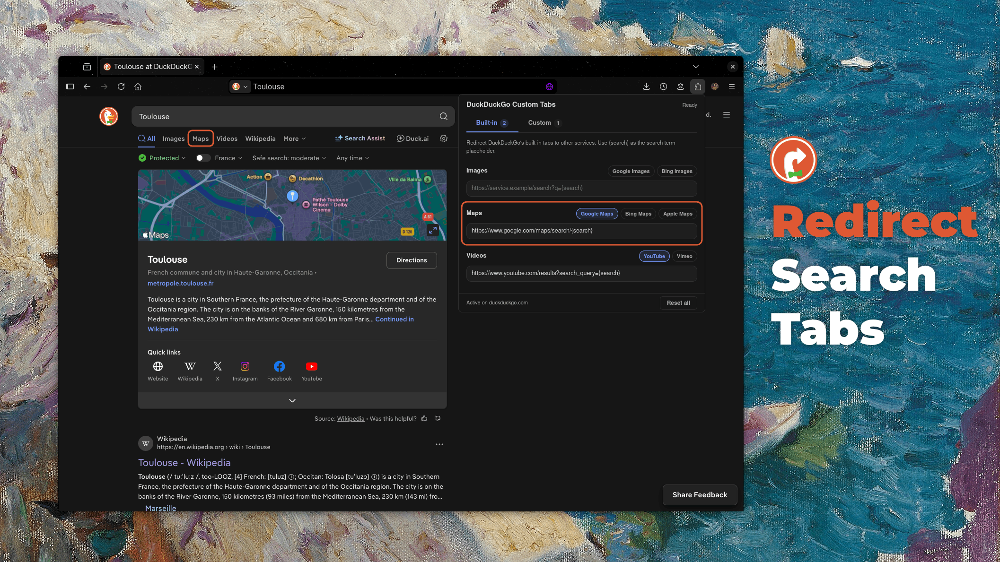
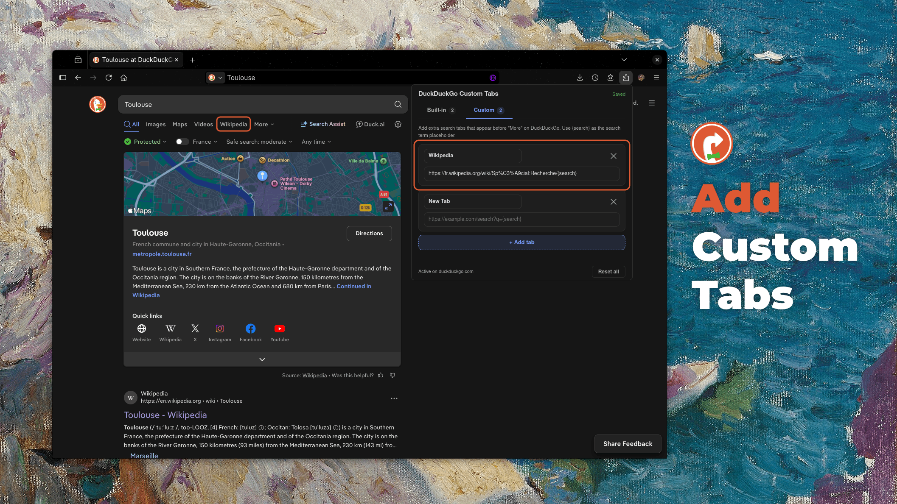

# DuckDuckGo Custom Tabs

A browser extension that lets you redirect DuckDuckGo search tabs like Maps, Videos, Images, and more to the services you prefer, such as Google Maps, YouTube, or X.

## What does it do?

- Redirect search tabs (Maps, Videos, Images, News, Shopping) to any URL
- Add new custom search tabs for any website (e.g. Wikipedia or Reddit)
- Configure service redirections in one click (Google Maps, Google Images, YouTube, etc.)
- Support fully custom URLs for complete flexibility

### Examples

- Open Google Maps when clicking the Maps search tab.
- Redirect the Videos tab to YouTube.
- Add a custom Translate tab redirecting to your preferred translator service.
- Add a custom Wikipedia tab that searches the current query.

### Overview

<div align="center">
  
  
</div>

## Installation

### On Firefox

Install the extension directly from the **[Mozilla Addons Store](https://addons.mozilla.org/en-US/firefox/addon/duckduckgo-custom-tabs/)**.

### On Chrome

Install the extension directly from the **[Chrome Store](https://chromewebstore.google.com/detail/duckduckgo-custom-tabs/gdldjooogiiofclofagphnlbfhfklmip)**.

### As a developer

If you want to test or modify the extension, follow these steps:

1. Clone the repository:
   ```bash
   git clone https://github.com/your-repo-name/duckduckgo-custom-tabs.git
   ```
2. Install dependencies:
   ```bash
   npm install
   ```
3. Build the extension:
   ```bash
   npm run build
   ```
4. Load the unpacked extension:
   - In Chrome: go to `chrome://extensions/`, enable Developer mode, and select "Load unpacked"
   - In Firefox: go to `about:debugging#/runtime/this-firefox`, choose "Load Temporary Add-on"

## Usage

Each tab redirection must have a valid URL template containing `{search}`.
The URL will be computed before redirection and `{search}` will be replaced by the current search query.

```text
https://www.google.com/maps/search/{search}
https://www.youtube.com/results?search_query={search}
https://en.wikipedia.org/wiki/Special:Search?search={search}
```

## Development workflow

- To start a development server (this will watch for changes and rebuild automatically):

  ```bash
  npm run dev
  ```

- To manually build the extension for production:

  ```bash
  npm run build
  ```

- To run tests:

  ```bash
  npm test
  ```

- To build and package:
  ```bash
  npm run release
  ```

## Notes

- The extension works only on `https://duckduckgo.com/*`.
- Compatible with the latest builds of both Chromium and Firefox.
